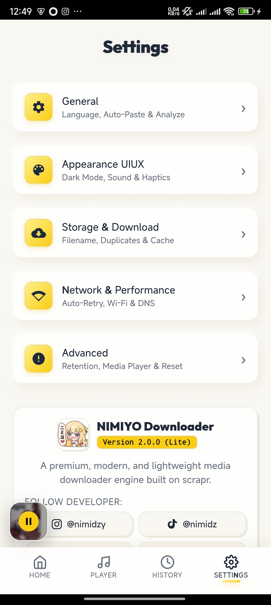
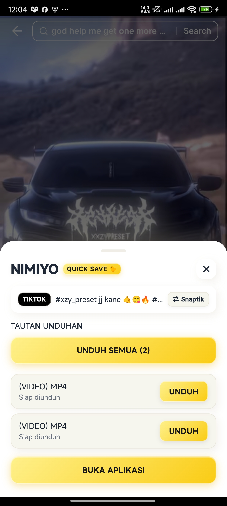
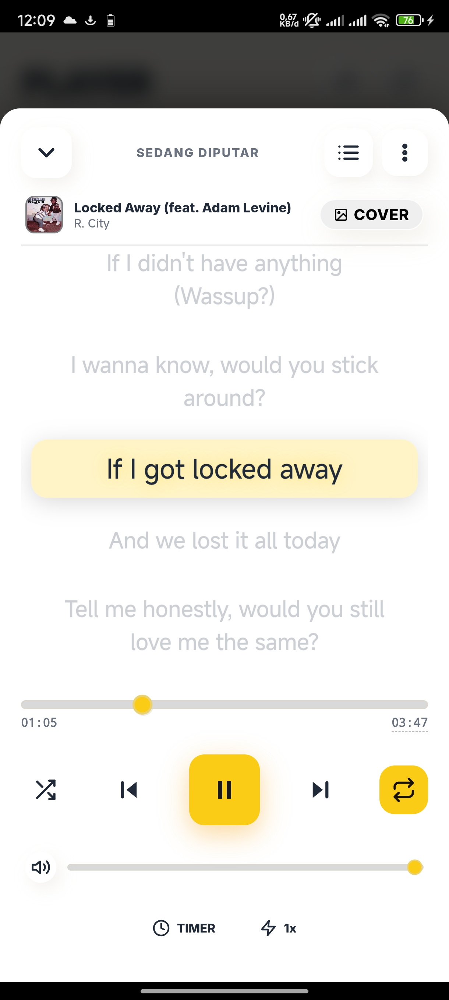
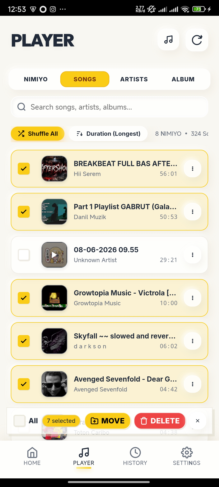
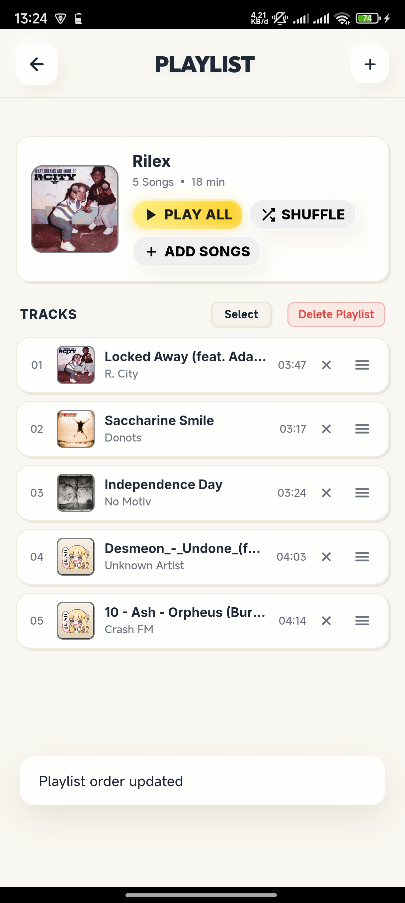

<div align="center">

  

  # 🎧 KYO Downloader & Music

  **A Premium, Ultra-Fast & Sleek Universal Media Downloader & Player**

  [](https://github.com/oziajayakan/kyo-myusic/releases)
  [](https://github.com/oziajayakan/kyo-myusic)
  [](LICENSE)
  [](kyo-api/)

  <br/>

  <p align="center">
    <b>Download videos, music, high-res photos, and audio tracks effortlessly from 15+ platforms without ads, limits, or server bottlenecks.</b>
  </p>

  <p align="center">
    <a href="https://github.com/oziajayakan/kyo-myusic/releases/latest">
      
    </a>
    <a href="kyo-api/">
      
    </a>
  </p>

</div>

---

## 📱 App Showcase

<div align="center">

| 1. Home / Analyzer | 2. Media Player & Tabs | 3. History & Storage |
| :---: | :---: | :---: |
|  |  |  |

| 4. Settings & UI/UX | 5. Quick Save Floating Panel | 6. Full Music Player Window |
| :---: | :---: | :---: |
|  |  |  |

| 7. Lyrics & Timestamps | 8. Multi-Select Song Manager | 9. Custom Playlists |
| :---: | :---: | :---: |
|  |  |  |

| 10. Built-in HD Video Player |
| :---: |
|  |

</div>

---

## ✨ Fitur Utama KYO

- ⚡ **All-In-One Universal Downloader**: Unduh video, audio track, album cover, slideshow, dan carousel foto.
- 📱 **Default 9:16 Ratio Desktop Experience**: Tampilan ramping bergaya mobile modern dengan presisi rasio 9:16 untuk kenyamanan penggunaan di Windows desktop.
- 🌐 **Self-Hosted Vercel API (`kyo-api`)**: Bebas dari pesan *"Server is busy / limit"* dengan mendeposit serverless scraper pribadi di Vercel secara gratis.
- 🎨 **Neobrutalism & Soft UI Aesthetics**: Tampilan visual futuristik cyberpunk/soft-glow dengan dukungan dark mode dan font modern (*MiSans, Inter, Outfit, Space Mono*).
- 🎵 **Built-In Offline Music Player**: Pemutar musik bawaan dengan playlist, penjelajah artis/album, sinkronisasi lirik, dan kontrol pemutaran halus.
- 🎬 **Integrated Video & Photo Viewer**: Pratinjau langsung untuk file riwayat unduhan dengan dukungan layar penuh dan kontrol pemutaran.
- 🔄 **Smart Concurrent Downloads**: Unduh beberapa media sekaligus dengan penanganan retry otomatis.
- 🌍 **Multilingual Localization**: Dukungan penuh untuk **Bahasa Indonesia**, **English**, **简体中文**, dan **日本語**.
- 🔒 **Privacy First**: Mode penyamaran (incognito), tanpa tracker pihak ketiga, dan riwayat tersimpan lokal.

---

## 🌐 Platform yang Didukung

| Platform | Video | Audio / MP3 | Foto / Album | Status |
| :--- | :---: | :---: | :---: | :---: |
| **YouTube** | ✅ | ✅ | ❌ |  |
| **TikTok** | ✅ (No Watermark) | ✅ | ✅ (Slideshow) |  |
| **Instagram** | ✅ (Reels/Stories) | ✅ | ✅ (Carousels) |  |
| **Shopee** | ✅ (HD Video) | ❌ | ✅ (Product Media) |  |
| **Spotify** | ❌ | ✅ (320kbps MP3) | ✅ (Cover Art) |  |
| **Apple Music** | ❌ | ✅ (HQ M4A/MP3) | ✅ (Cover Art) |  |
| **Twitter / X** | ✅ (HD) | ❌ | ✅ |  |
| **Facebook** | ✅ (Reels/Watch) | ✅ | ✅ |  |
| **Threads** | ✅ | ❌ | ✅ |  |
| **Pinterest** | ✅ | ❌ | ✅ (High-Res) |  |
| **Bilibili** | ✅ | ✅ | ❌ |  |
| **Douyin** | ✅ (No Watermark) | ✅ | ✅ |  |
| **Bandcamp** | ❌ | ✅ (Lossless/MP3) | ✅ |  |
| **Pixiv** | ❌ | ❌ | ✅ (Full Size) |  |
| **RedNote (小红书)** | ✅ | ❌ | ✅ (HD Images) |  |

---

## 🛠️ Struktur Repositori

```
kyo-myusic/
├── assets/                   # Media Assets, KYO Icon & Showcase Screenshots
│   ├── kyo_logo.jpg
│   ├── kyo_music_logo.webp
│   └── screenshots/
├── kyo-api/                  # Vercel Serverless Scraper API
│   ├── api/
│   │   ├── _scrapers/        # TikTok & YouTube scrapers
│   │   ├── analyze.js        # Main endpoint (/api/analyze)
│   │   └── health.js         # Health check endpoint (/api/health)
│   ├── package.json
│   ├── vercel.json
│   └── README.md
├── src/                      # Web UI & Application Logic (KYO Engine)
│   ├── index.html            # Main KYO Application UI
│   ├── app.js                # State Management & Localization
│   ├── index.css             # Neobrutalist Design System Tokens
│   ├── soft-ui.css           # Soft UI Modern Tokens
│   └── js/musicPlayer.js     # Native-Style Music Player Engine
├── electron/                 # Electron Desktop Container
│   ├── main.js               # 9:16 Aspect Ratio Window & Lifecycle
│   └── preload.js
├── dist-electron/            # Compiled Windows Executable & Portable Packages
├── build.js                  # Frontend Syncer & Asset Builder
├── pack-win.js               # Windows Desktop Builder
└── package.json              # App Manifest & Scripts
```

---

## 🚀 Menjalankan & Membangun dari Source

### Persyaratan
- **Node.js**: v18 atau lebih tinggi
- **Git**

### Langkah Menjalankan Desktop App
1. **Clone repository**:
   ```bash
   git clone https://github.com/oziajayakan/kyo-myusic.git
   cd kyo-myusic
   ```

2. **Install dependencies**:
   ```bash
   npm install
   ```

3. **Jalankan Aplikasi (Development)**:
   ```bash
   npm start
   ```

4. **Build Windows .EXE**:
   ```bash
   npm run dist
   ```
   *File .exe dan portable bundle akan dibuat di dalam folder `dist-electron/`.*

---

## ☁️ Deploy Server Sendiri ke Vercel

Jika scraper publik sedang sibuk, deploy backend `kyo-api` ke Vercel:
1. Buka folder `kyo-api`.
2. Push folder tersebut ke GitHub Anda.
3. Import project di [Vercel Dashboard](https://vercel.com) dan klik **Deploy**.
4. Masukkan URL Vercel Anda di Pengaturan aplikasi KYO.

---

<div align="center">
  <sub>Made with passion for media freedom. © 2026 KYO Music.</sub>
</div>
